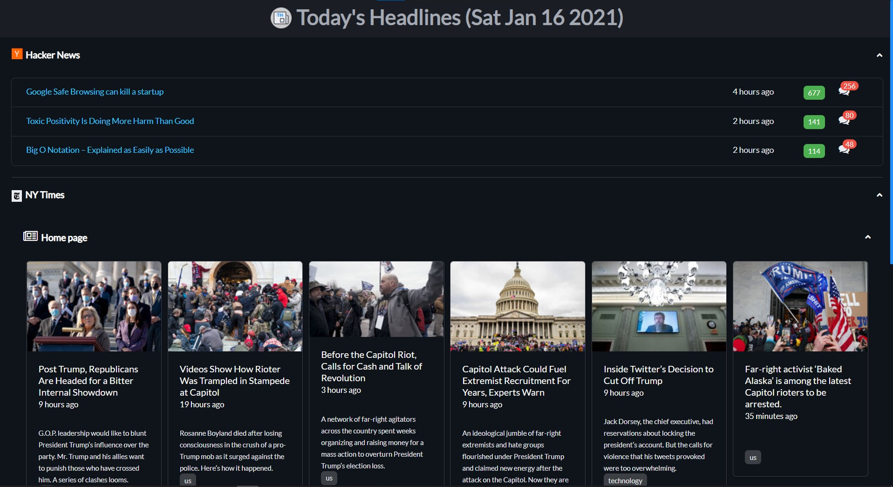

<div align="center">
  
  <h2>Today's Headlines</h2>
</div>

<p>A small personal news dashboard built on <a href="https://electron-react-boilerplate.js.org/">Electron React Boilerplate</a> with data from Hacker News, NY Times, and HLTV. Beware: code smells for days in this repo but, hey, gotta move fast. Here's a peek:</p>

<div align="center">
  
</div>

### Secrets
Create a file `.env` at the project root and add the following to it:
```
REACT_APP_NYT_API_KEY=<your NY Times API key>
```

### Package
```
yarn package
```
Run `Today's Headlines Setup 0.0.1` under the `release` directory.

### Run in dev
```
yarn start
```
